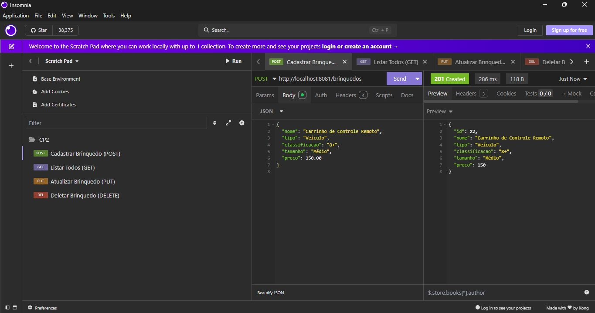
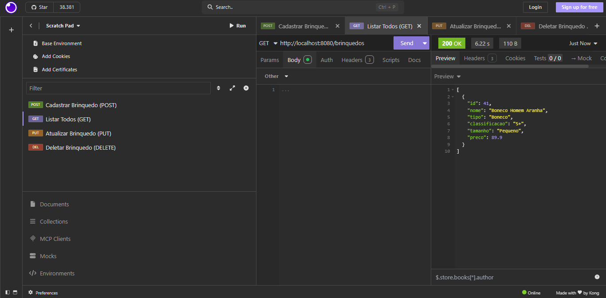
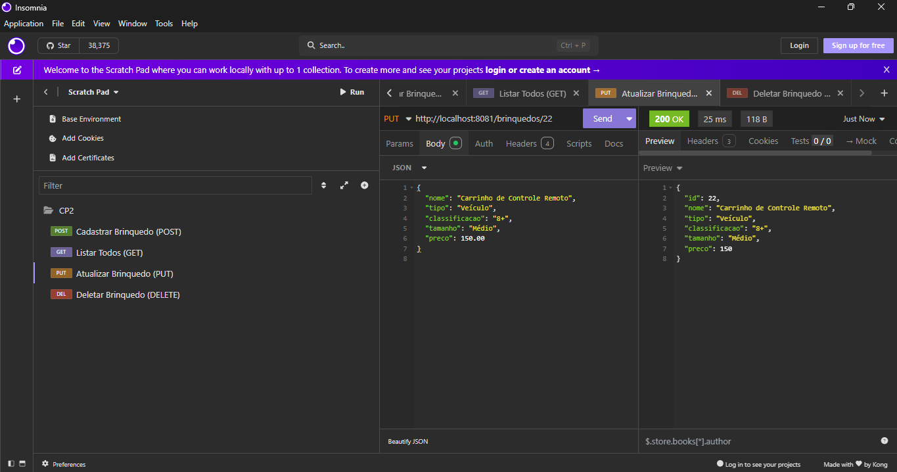
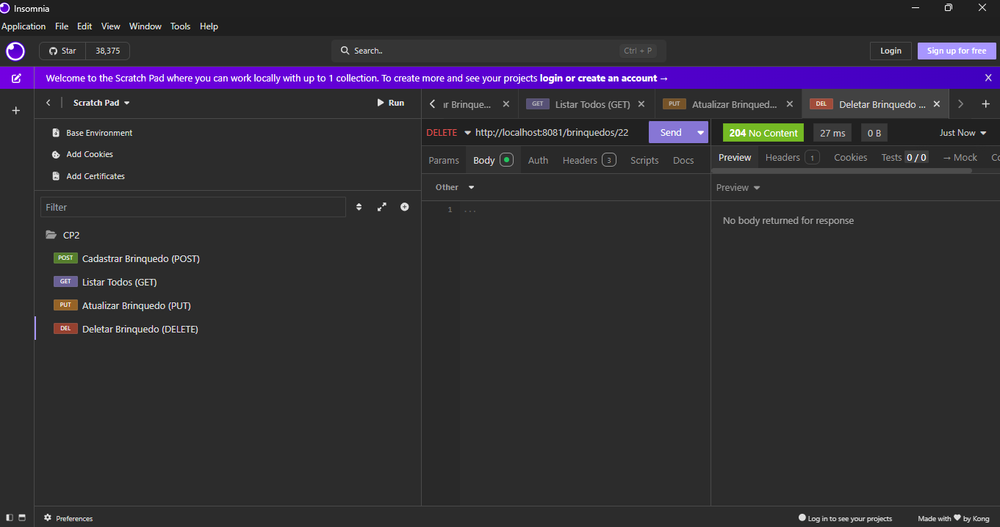

# Checkpoint 2 - Java Advanced - FIAP

## 📝 Descrição do Projeto
Este projeto é um sistema de gerenciamento de estoque para uma empresa de brinquedos (público até 14 anos). Ele foi desenvolvido utilizando o framework **Spring Boot**, com gerenciamento de dependências via **Maven** e persistência em banco de dados **Oracle**.

O sistema expõe uma API REST que permite realizar todas as operações de um CRUD (Create, Read, Update, Delete) para a entidade `Brinquedo`.

---

## 👥 Integrantes do Grupo
- **Nome:** Gabriel Robertoni Padilha - **RM:** 566293
- **Nome:** Bruno Ferreira - **RM:** 563489
- **Nome:** Leonardo Aragaki Rodrigues - **RM:** 562944

**Link do Repositório:** https://github.com/GabrielRobertoni/cp2-java-advanced-fiap.git

---

## 🛠️ Tecnologias e Configurações
- **Java:** 21
- **Spring Boot:** 3.4.5
- **Banco de Dados:** Oracle SQL Developer
- **Build Tool:** Maven
- **Dependências Principais:** Spring Web, Spring Data JPA, Oracle Driver (OJDBC11).

### Configuração do Spring Initializr

*Legenda: Configuração inicial do projeto com as dependências solicitadas.*

---

## 🚀 Testes de Endpoints (CRUD)

Abaixo estão as evidências dos testes realizados via Postman no `localhost:8080`.

### 1. Create (Cadastrar Brinquedo)
**Método:** `POST` | **URL:** `/brinquedos`
- **Descrição:** Envio de um JSON com os dados do brinquedo para persistência no banco Oracle.
- **JSON de Teste:**
```json
{
  "nome": "Carrinho de Controle Remoto",
  "tipo": "Veículo",
  "classificacao": "8+",
  "tamanho": "Médio",
  "preco": 150.00
}
```
![Print do POST no Postman] 

### 2. Read (Consultar Brinquedos)
**Método:** `GET` | **URL:** `/brinquedos`
- **Descrição:** Recuperação de todos os registros armazenados na tabela `TDS_TB_BRINQUEDOS`.
![Print do GET no Postman] 

### 3. Update (Atualizar Brinquedo)
**Método:** `PUT` | **URL:** `/brinquedos/{id}`
- **Descrição:** Atualização dos dados de um brinquedo existente através do seu ID.
![Print do PUT no Postman] 

### 4. Delete (Remover Brinquedo)
**Método:** `DELETE` | **URL:** `/brinquedos/{id}`
- **Descrição:** Exclusão definitiva de um registro do banco de dados pelo ID informado.
![Print do DELETE no Postman] 

---

## 📂 Estrutura de Arquivos Importantes
- `src/main/java/.../entity/Brinquedo.java`: Mapeamento da entidade JPA.
- `src/main/java/.../controller/BrinquedoController.java`: Endpoints da API.
- `src/main/resources/application.properties`: Configurações de conexão do Spring.
- `src/main/resources/META-INF/persistence.xml`: Configuração de persistência solicitada no roteiro.

---
*Projeto desenvolvido para fins acadêmicos - FIAP 2025.*
